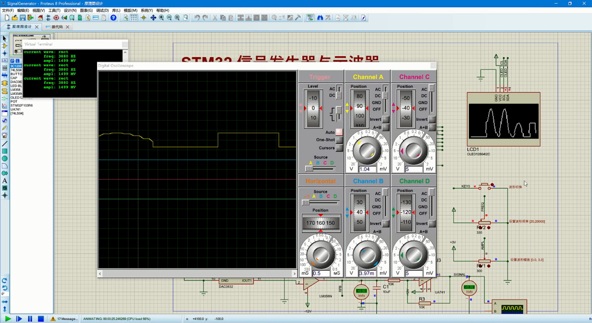

# STM32信号发生器与示波器

## 功能

- 发出正弦波与方波
- 频率可调 [100HZ, 20kHZ]
- 幅值可调 [0.0V, 3.0V]
- OLED显示波形
- 串口打印波形信息

## 实现方法

### 1 产生波形

主要通过对DAC0832写数据来产生模拟量电压，程序预先存写正弦波和矩形波的码表，然后不断循环将码表中的数据发送给DAC芯片。

### 2 频率控制

>  波形的频率是指产生一个完整的周期所需要的时间

这里通过定时器2中断不断的对码表中256个数据进行发送，假如定时器2的频率是`timhz`，则产生一个完整波形的时间就是$freq = 256*timhz$，定时器的频率计算公式为`timhz=72000000/((arr+1)*(psc+1))`，设置预分频$psc=1$，就可以得到波形频率`freq`与定时器计数值`arr`之间的关系。

但是在程序中并不是通过以上方法计算的，在硬件中是通过一个电位计来控制频率的，STM32读取电位器的电压值数字量为[0,4095]，对应于频率范围[100, 20000]，而产生[100, 20000]的频率对应的计数值为[1405, 6]，因此只需要将[0, 4095]映射到[6, 1405]上去，最后得到的实际频率为$20000-100-freq$。

### 3 幅值控制

> 幅度指定波形的水平轴和垂直位置之间的最大距离。例如，振幅为5 V的正弦波的最大值为+5 V，最小值为–5V。

幅值同样是通过电位器控制，电位器电压为[0.0V, 3.0V]，对应与数字量为[0, 3719]，（3719是实际测量值，并不是计算得到），码表中的数据为[0, 255]，找出这三者之间的关系即可。

## 4 OLED显示波形

波形显示事实上就是对采样的值在OLED上打点，ADC采样得到的数字量是[0,4095]，而OLED的纵向像素是[0-63]，因此只需要将数字量转化为[0,63]之间即可，而在OLED上打点的密度可以通过程序设置，比如你想要在屏幕上每隔一个像素打一个，或者两个像素、三个像素都是可以的

## 5 ADC采样方法

对ADC采样是通过DMA+ADC+TIM3实现的，具体如下：每一次接收完成一帧ADC数据会触发DMA中断，在DMA中断中关闭DMA转换，并设置转换完成标志位为1，TIM3每来一个中断就会检测DMA转换完成标志位，如果标志位为1则清零标志位，并开始处理ADC数据，后打开DMA转换。

